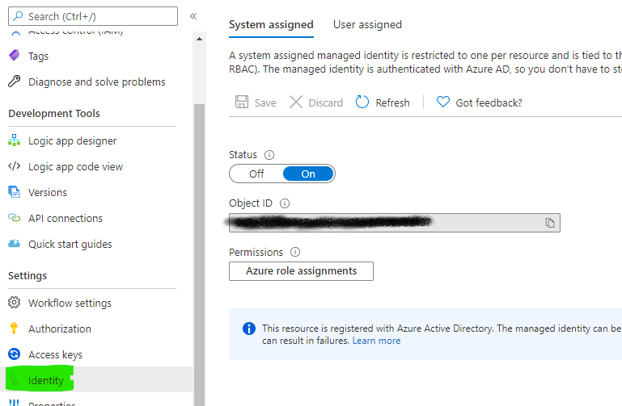
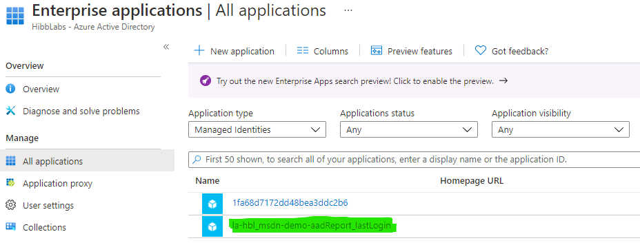
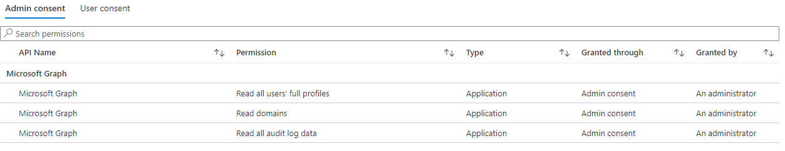

# Azure AD Last Logon - Microsoft Graph

A common across enterprises is the ability to report on in active accounts. Azure Active Directory (AAD) logs the last successful user logon. The sign-on information can be queried using the [Microsoft Graph API](https://docs.microsoft.com/en-us/graph/overview).

The Microsoft Graph can be queried with Python, PowerShell, etc. The least effort option to query the Graph and collect information is by using an [Azure Logic App](https://docs.microsoft.com/en-us/azure/logic-apps/logic-apps-overview). The Logic App can offer a low/no code simple solution to capture and process data, and simplifie authentication with the use of a [Managed Serivce Ideneity (MSI)](https://docs.microsoft.com/en-us/azure/active-directory/managed-identities-azure-resources/overview).

At this time this process will walk you through the process of creating an Azure Logic App and required configuration to capture sign-on information from AAD via the Microsoft Graph API. 

<br>

## Requirements

- Active Azure Enrollment/Subscription
- [Azure Active Directory P1/P2 ](https://docs.microsoft.com/en-us/azure/active-directory/reports-monitoring/concept-all-sign-ins#what-azure-ad-license-do-you-need-to-access-sign-in-activity)
- [Authorization to provide AAD Admin Consent](https://docs.microsoft.com/en-us/azure/active-directory/manage-apps/grant-admin-consent#prerequisites)
- Azure Logic App

<br>

## Logic App Creation

First step is to create a new logic app in your existing Azure subscription. To begin there is no special configuration needed. Use your prefered method to deploy an empty Logic App.

- [Quickstart-Portal](https://docs.microsoft.com/en-us/azure/logic-apps/quickstart-create-first-logic-app-workflow)
- [Quickstart-ARM Template](https://docs.microsoft.com/en-us/azure/logic-apps/quickstart-create-deploy-azure-resource-manager-template?tabs=azure-portal)
- [Terraform Registry - azurerm_logic_app_workflow](https://registry.terraform.io/providers/hashicorp/azurerm/latest/docs/resources/logic_app_workflow)

<br>

### Logic App Managed Service Identity

A System Assigned Managed Service Identity (MSI) will be used to allow the Logic App to authenticate to the Microsoft Graph API directly without the need to manage an seperate identity/service principal.



To enable MSI:

- From the Logic App select the **'Identity'** blade.
- Switch **Status** to **On**.
- Click **Save**

With that process completed a new **Enterprise Application** will be created in Azure AD for the logic app. This identity can be granted rights and permissions the same as any other AAD application / identity.



<br>

## AAD Permissions

The Logic App MSI requires permission in Azure Active Directory to read user properties from the directory. The request permissions are:

|Permission|Description|
|---|---|
|Domain.Read.All|Grant permissions to read **all** domains|
|AuditLog.Read.All|Grants read access to the Azure AD audit logs|
|User.Read.All|Grants permission to read **all** user profiles in the directory|

<br>

I put together a PowerShell script to assign the required permissions to Logic App Managed Identity. The script requiers the AzureAD PowerShell modules. And can be run from the Azure Cloud Shell if available. 

**note**: This script is rough and doesn't have any error handling yet(tm).

<br>

```powershell
#Requires -Modules {AzureAD}

[CmdletBinding()]
param (
    [Parameter(Mandatory=$true)][string]$TenantID,          # Azure Active Directory TenantID
    [Parameter(Mandatory=$true)][string]$MSIDisplayName     # Matches the resource name
)

# Microsoft Graph App ID (Don't change, the same for all AAD directories)
$GraphAppId = "00000003-0000-0000-c000-000000000000"

$requiredPermissions = @(
    'Domain.Read.All',
    'AuditLog.Read.All',
    'User.Read.All'
)

Connect-AzureAD -TenantId $TenantID

$MSI = (Get-AzureADServicePrincipal -Filter "displayName eq '$MSIDisplayName'")

$GraphServicePrincipal = Get-AzureADServicePrincipal -Filter "appId eq '$GraphAppId'"

$AppRole = @()

$requiredPermissions | ForEach-Object {
    $permissionName = $_
    $temp = $GraphServicePrincipal.AppRoles | `
        Where-Object {$_.Value -eq $permissionName -and $_.AllowedMemberTypes -contains "Application"}

    $AppRole += $temp
}

#Assign permissions to Managed Identity
# NOTE: This will throw and error if the permission is already applied. 
$AppRole | ForEach-Object {
    New-AzureAdServiceAppRoleAssignment -ObjectId $MSI.ObjectId `
        -PrincipalId $MSI.ObjectId `
        -ResourceId $GraphServicePrincipal.ObjectId `
        -Id $_.Id
}
```

With a succesful run of the script the MSI permissions will be updated.



<br>

## Logic App Workflow

### Trigger


### HTTP Action - GET Microsoft Graph


### Intiaite Variable

### Parse JSON
